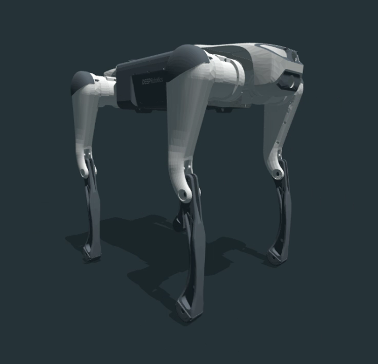
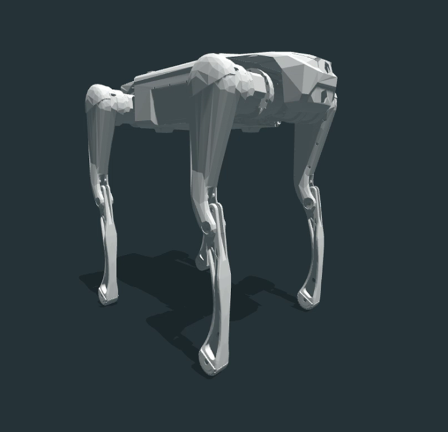
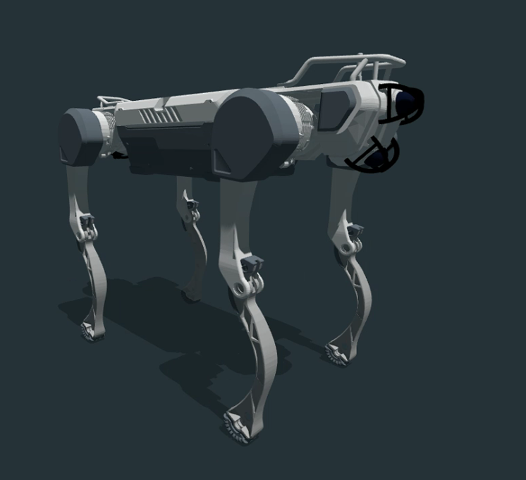
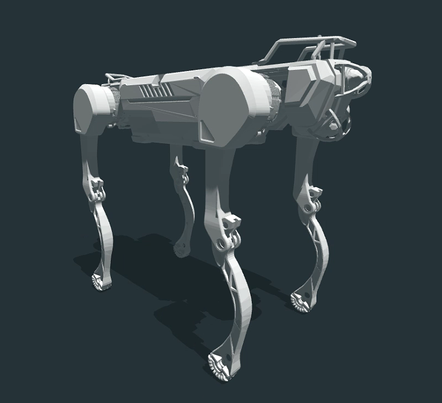
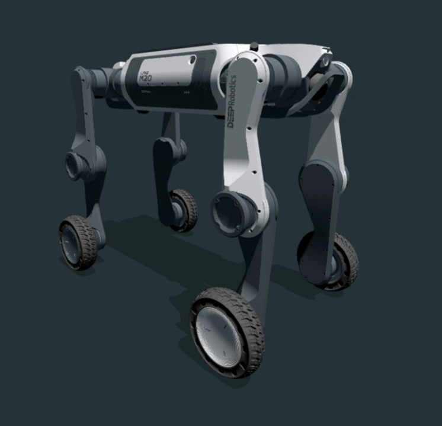
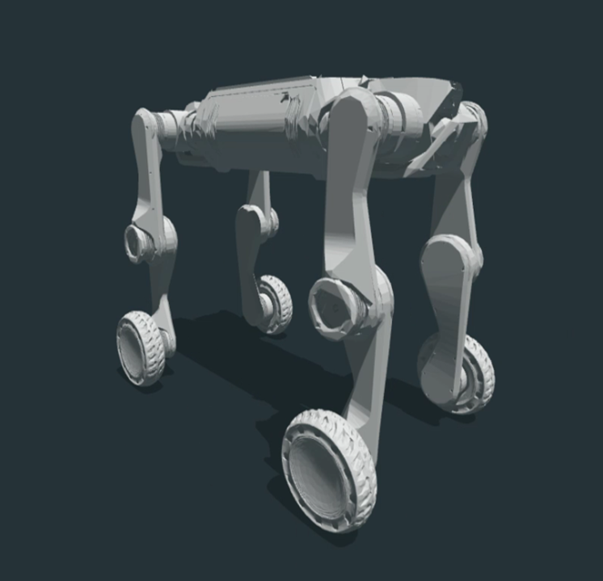
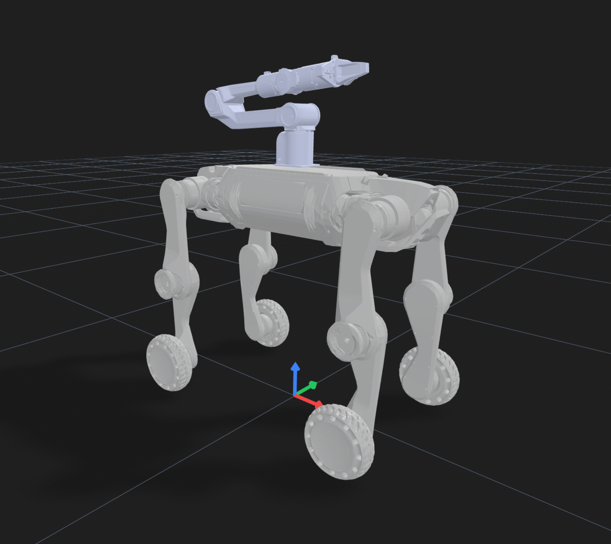

# Robot Models Repository

This repository contains 3D models for four Deep Robotics robots: **Lite3**, **M20**, **X30**, and **M20_Piper**. Each model is provided in MJCF, URDF, and USD formats. To visualize the model and do some measuring, I recommend using this [tool](https://viewer.robotsfan.com/). Just drag your folder to the web page and you can see everything.

**Note**: This repository only contains low resolution files. To download the high resolution files, please use [this link](https://drive.google.com/drive/folders/1EOELXUYSBPEJeD0rUIkJxnlLMDr6IHBV?usp=sharing)

## Model Overview
**Note**: High resolution models are good for new simulators like isaaclab/isaacsim but old simulators like pybullet cannot open files this big.
| Robot Model | High Resolution Image | Low Resolution Image |
|:-----------:|:---------------------:|:--------------------:|
| **Lite3**   |  Lite3/Lite3_urdf/urdf/Lite3_high_res.urdf |  Lite3/Lite3_urdf/urdf/Lite3.urdf |
| **X30**     |  X30/X30_urdf/urdf/X30_high_res.urdf |  X30/X30_urdf/urdf/X30.urdf |
| **M20**     |  M20/M20_urdf/urdf/M20_high_res.urdf |  M20/M20_urdf/urdf/M20.urdf |
| **M20_Piper** | *Not available yet* |  M20_Piper/URDF/urdf/M20_Piper.urdf |

## Contributors
See the [Contributors](Contributors.md) page for a list of contributors.

